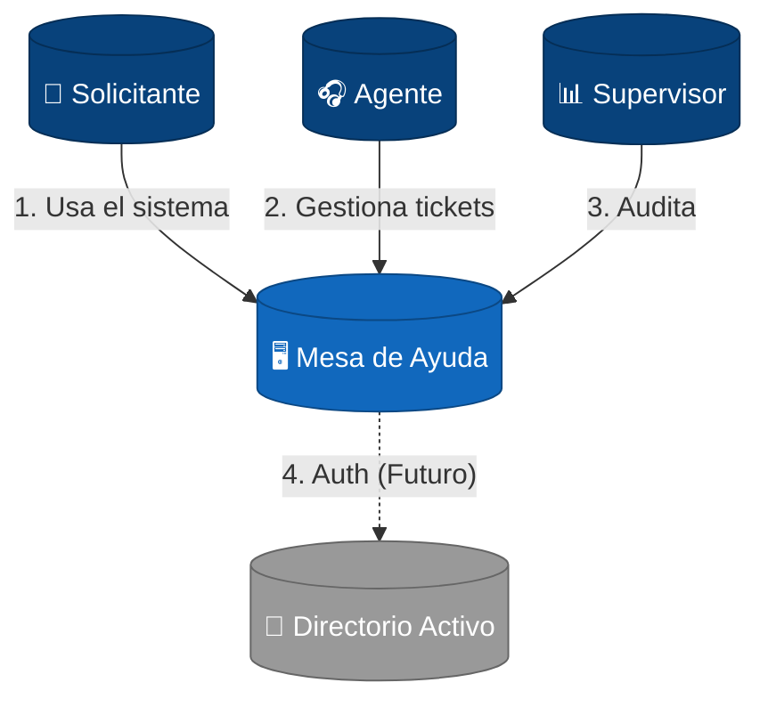
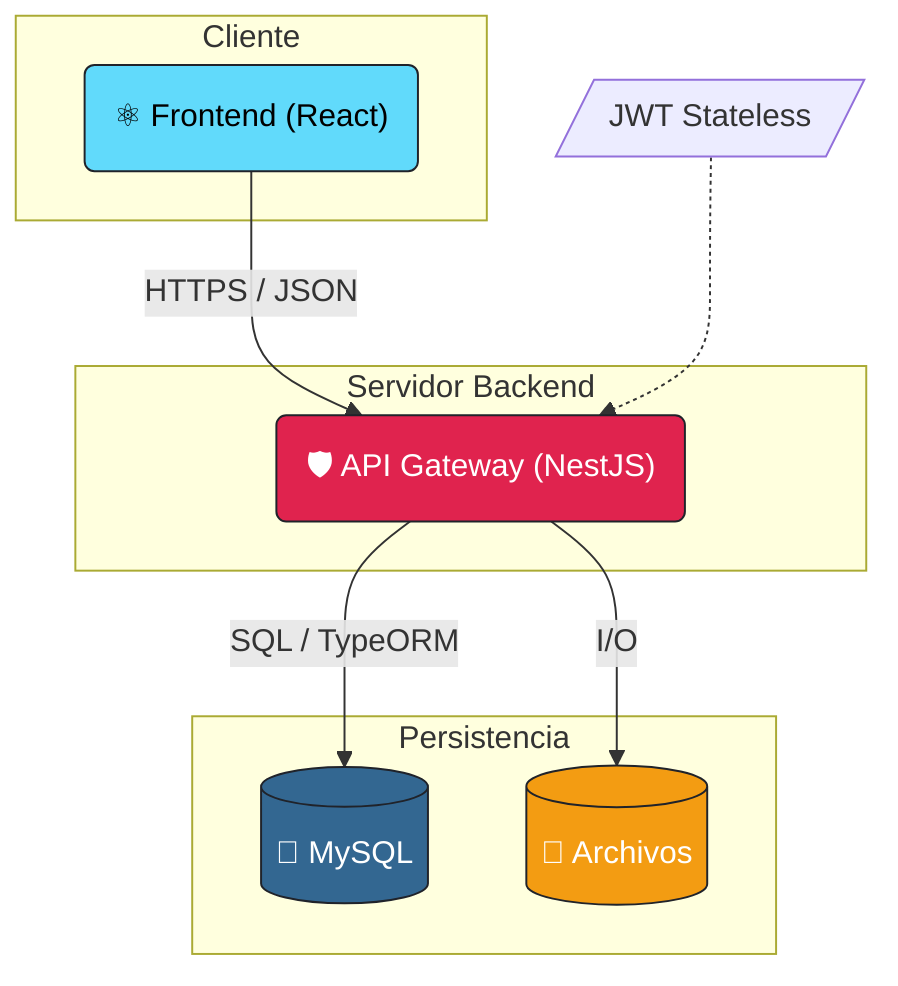

# Documentación de Arquitectura de Software (Modelo C4)

## 1. Contexto del Negocio
El sistema **Help Desk (Mesa de Ayuda)** es una plataforma empresarial diseñada para centralizar, gestionar y resolver incidentes y solicitudes de servicio. Su objetivo principal es optimizar los tiempos de respuesta (SLA), garantizar la trazabilidad de los procesos y permitir una comunicación fluida entre los empleados (solicitantes) y el equipo de soporte (agentes).

### Objetivos Clave
*   **Centralización**: Un único punto de entrada para todos los requerimientos.
*   **Automatización**: Flujos de trabajo configurables que asignan tickets automáticamente según reglas de negocio.
*   **Seguridad**: Control de acceso granular basado en Roles y Habilidades (CASL).
*   **Visibilidad**: Dashboards y reportes de cumplimiento de SLA.

---

## 2. Nivel 1: Diagrama de Contexto del Sistema
Este nivel representa el "Big Picture". Muestra el sistema en el centro y su relación con los usuarios.

---

## 3. Nivel 2: Diagrama de Contenedores (Arquitectura Técnica)
Este nivel detalla la arquitectura de software, mostrando los contenedores desplegables y sus responsabilidades.

---

## 4. Stack Tecnológico y Decisiones
Justificación de las tecnologías elegidas para garantizar escalabilidad y mantenibilidad.

### 4.1 Frontend (La Cara del Usuario)
*   **Tecnología**: **React** con **Vite**.
*   **Lenguaje**: TypeScript (Strict Mode).
*   **Estilos**: **Tailwind CSS**. No usamos CSS puro ni preprocesadores complejos para mantener la consistencia y velocidad de desarrollo.
*   **Estado**: React Context + Hooks. Gestión ligera sin la complejidad de Redux.
*   **Rol**: Renderizado de UI, validación de formularios y experiencia de usuario interactiva (SPA).

### 4.2 Backend (El Cerebro)
*   **Tecnología**: **NestJS**. Framework progresivo que impone una arquitectura modular y ordenada.
*   **Lenguaje**: TypeScript. Comparte tipos e interfaces con el frontend.
*   **Seguridad**: **Passport + JWT**. Autenticación sin estado (Stateless).
*   **Autorización**: **CASL**. Control de permisos granular basado en habilidades (Attribute Based Access Control - ABAC).

### 4.3 Datos (La Memoria)
*   **Base de Datos**: **MySQL**. Robusta, relacional y consistente.
*   **ORM**: **TypeORM**. Abstracción de base de datos que facilita migraciones y manejo de entidades.
*   **Almacenamiento**: Sistema de archivos local para PDFs y adjuntos (escalable a S3 en el futuro).

---

## 5. Flujo Crítico: Ciclo de Vida de un Ticket
Para entender cómo conectan las piezas, describimos el viaje de un dato a través de la arquitectura:

1.  **Frontend**: El usuario llena el formulario "Crear Ticket". React valida los campos requeridos.
2.  **Request**: Se envía un `POST /tickets` con el token JWT en la cabecera `Authorization`.
3.  **Backend (Guard)**: `JwtAuthGuard` verifica el token. `PoliciesGuard` verifica si el usuario tiene permiso `create` sobre `Ticket`.
4.  **Backend (Service)**: `TicketService` recibe los datos, calcula asignaciones automáticas (Motor de Reglas) e inicia el flujo.
5.  **Base de Datos**: Se inserta el registro en MySQL dentro de una transacción.
6.  **Respuesta**: El backend confirma la creación (`201 Created`) y el frontend redirige al usuario al detalle del ticket o listado.
