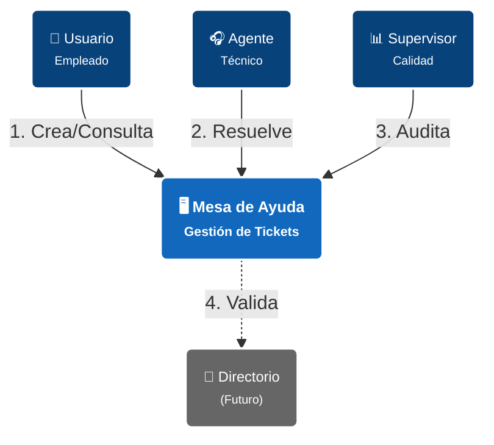
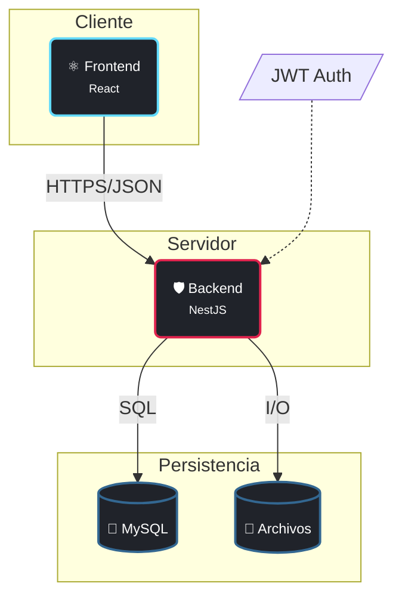

# Documentación de Arquitectura de Software (Modelo C4)

## 1. Contexto del Negocio
Sistema centralizado para la gestión de incidentes (**Mesa de Ayuda**). Optimiza la comunicación entre empleados y soporte técnico.

---

## 2. Nivel 1: Diagrama de Contexto
Visión general de actores y sistema.

---

## 3. Nivel 2: Arquitectura Técnica (Contenedores)
Conexión entre Frontend, Backend y Datos.

---

## 4. Stack Tecnológico

### 4.1 Frontend (React + Vite)
*   **UI**: Tailwind CSS para diseño rápido y responsivo.
*   **Lógica**: Hooks y Context API.
*   **Comunicación**: Axios para peticiones REST a la API.

### 4.2 Backend (NestJS)
*   **Core**: Arquitectura modular (Controladores, Servicios).
*   **Seguridad**: Passport (JWT) + CASL (Permisos).
*   **Datos**: TypeORM para manejo seguro de base de datos.

### 4.3 Base de Datos (MySQL)
*   Relacional, transaccional y robusta para la integridad de los tickets.

---

## 5. Ciclo de Vida: Crear Ticket
1.  **React**: Valida formulario y envía JSON (`POST /tickets`).
2.  **NestJS**:
    *   `Guards`: Valida Token y Permisos.
    *   `Service`: Ejecuta reglas de negocio (asignación).
    *   `TypeORM`: Guarda en MySQL.
3.  **Respuesta**: Confirma creación (`201 Created`).
