# Documentación de Arquitectura de Software (Modelo C4)

## 1. Contexto del Negocio
Sistema centralizado para la gestión de incidentes (**Mesa de Ayuda**). Optimiza la comunicación entre empleados y soporte técnico.

---

## 2. Nivel 1: Diagrama de Contexto
Visión general de actores y sistema.

```mermaid
graph TD
    %% Clases (Estilos Compactos)
    classDef person fill:#08427b,stroke:#fff,stroke-width:2px,color:white,font-size:12px;
    classDef system fill:#1168bd,stroke:#fff,stroke-width:2px,color:white,font-size:13px,font-weight:bold;
    classDef external fill:#666,stroke:#fff,stroke-width:2px,color:white,font-size:12px;

    %% Nodos (Textos Cortos)
    User("👤 Usuario<br><small>Empleado</small>"):::person
    Agent("🎧 Agente<br><small>Técnico</small>"):::person
    Boss("📊 Supervisor<br><small>Calidad</small>"):::person

    System("🖥️ Mesa de Ayuda<br><small>Gestión de Tickets</small>"):::system

    AD("🪪 Directorio<br><small>(Futuro)</small>"):::external

    %% Relaciones (Etiquetas Cortas)
    User -- "1. Crea/Consulta" --> System
    Agent -- "2. Resuelve" --> System
    Boss -- "3. Audita" --> System
    
    System -. "4. Valida" .-> AD
```

---

## 3. Nivel 2: Arquitectura Técnica (Contenedores)
Conexión entre Frontend, Backend y Datos.

```mermaid
graph TD
    %% Estilos
    classDef spa fill:#20232a,stroke:#61dafb,stroke-width:2px,color:white,font-size:12px;
    classDef api fill:#20232a,stroke:#e0234e,stroke-width:2px,color:white,font-size:12px;
    classDef db fill:#20232a,stroke:#336791,stroke-width:2px,color:white,font-size:12px;

    subgraph "Cliente"
        SPA("⚛️ Frontend<br><small>React</small>"):::spa
    end

    subgraph "Servidor"
        API("🛡️ Backend<br><small>NestJS</small>"):::api
    end

    subgraph "Persistencia"
        DB[("🐬 MySQL")]:::db
        FS[("📂 Archivos")]:::db
    end

    %% Flujos
    SPA -- "HTTPS/JSON" --> API
    API -- "SQL" --> DB
    API -- "I/O" --> FS

    %% Notas
    note1[/"JWT Auth"/] -.-> API
```

---

## 4. Stack Tecnológico

### 4.1 Frontend (React + Vite)
*   **UI**: Tailwind CSS para diseño rápido y responsivo.
*   **Lógica**: Hooks y Context API.
*   **Comunicación**: Axios para peticiones REST a la API.

### 4.2 Backend (NestJS)
*   **Core**: Arquitectura modular (Controladores, Servicios).
*   **Seguridad**: Passport (JWT) + CASL (Permisos).
*   **Datos**: TypeORM para manejo seguro de base de datos.

### 4.3 Base de Datos (MySQL)
*   Relacional, transaccional y robusta para la integridad de los tickets.

---

## 5. Ciclo de Vida: Crear Ticket
1.  **React**: Valida formulario y envía JSON (`POST /tickets`).
2.  **NestJS**:
    *   `Guards`: Valida Token y Permisos.
    *   `Service`: Ejecuta reglas de negocio (asignación).
    *   `TypeORM`: Guarda en MySQL.
3.  **Respuesta**: Confirma creación (`201 Created`).
