# Documentación de Arquitectura de Software (Modelo C4)

## 1. Contexto del Negocio
El sistema **Help Desk (Mesa de Ayuda)** es una plataforma empresarial diseñada para centralizar, gestionar y resolver incidentes y solicitudes de servicio. Su objetivo principal es optimizar los tiempos de respuesta (SLA), garantizar la trazabilidad de los procesos y permitir una comunicación fluida entre los empleados (solicitantes) y el equipo de soporte (agentes).

### Objetivos Clave
*   **Centralización**: Un único punto de entrada para todos los requerimientos.
*   **Automatización**: Flujos de trabajo configurables que asignan tickets automáticamente según reglas de negocio.
*   **Seguridad**: Control de acceso granular basado en Roles y Habilidades (CASL).
*   **Visibilidad**: Dashboards y reportes de cumplimiento de SLA.

---

## 2. Nivel 1: Diagrama de Contexto del Sistema
Este nivel representa el "Big Picture". Muestra el sistema en el centro y su relación con los usuarios.

```mermaid
graph TD
    %% Estilos de Nodos
    classDef person fill:#08427b,stroke:#052e56,color:white,rx:5,ry:5;
    classDef system fill:#1168bd,stroke:#0b4884,color:white,rx:5,ry:5;

    %% Actores Principales
    Solicitante[("👤 Solicitante")]:::person
    Agente[("🎧 Agente")]:::person
    Supervisor[("📊 Supervisor")]:::person

    %% Sistema Central
    HelpDesk[("🖥️ Mesa de Ayuda")]:::system

    %% Interacciones
    Solicitante -- "1. Usa el sistema" --> HelpDesk
    Agente -- "2. Gestiona tickets" --> HelpDesk
    Supervisor -- "3. Audita" --> HelpDesk
```

---

## 3. Nivel 2: Diagrama de Contenedores (Arquitectura Técnica)
Este nivel detalla los contenedores específicos y las tecnologías que dan vida al sistema.

```mermaid
graph TD
    %% Estilos
    classDef spa fill:#61dafb,stroke:#20232a,color:black,rx:5,ry:5;
    classDef api fill:#e0234e,stroke:#20232a,color:white,rx:5,ry:5;
    classDef db fill:#336791,stroke:#20232a,color:white,rx:5,ry:5;
    classDef fs fill:#f39c12,stroke:#20232a,color:white,rx:5,ry:5;

    subgraph "Navegador Web (Cliente)"
        SPA("⚛️ Single Page App<br>(React + Vite)"):::spa
    end

    subgraph "Servidor de Aplicación (Backend)"
        API("🛡️ API REST Core<br>(NestJS)"):::api
    end

    subgraph "Infraestructura de Datos"
        DB[("🐬 Base de Datos<br>(MySQL 8)")]:::db
        Files[("📂 Almacenamiento<br>(Local Disk)")]:::fs
    end

    %% Relaciones Específicas
    SPA -- "JSON / HTTPS (Axios)" --> API

    API -- "Query / TCP (TypeORM)" --> DB
    API -- "fs.writeFile / Stream" --> Files

    %% Detalles Internos del Backend (Notas)
    note1[/"Auth: Passport + JWT"/]
    note2[/"ACL: CASL (Roles)"/]
    
    note1 -.-> API
    note2 -.-> API
```

### Componentes Clave del Nivel 2
1.  **Single Page App (SPA)**: Aplicación React compilada con Vite. Se ejecuta totalmente en el navegador del usuario. Usa `Axios` para comunicarse con el servidor.
2.  **API REST Core**: Aplicación Node.js construida sobre NestJS. Actúa como orquestador central.
    *   **Passport + JWT**: Maneja la identificación segura de usuarios por token.
    *   **CASL**: Motor que decide "quién puede hacer qué" dentro de la API.
3.  **MySQL**: Motor de base de datos relacional. Almacena usuarios, tickets, flujos y configuraciones. Conectado vía `TypeORM`.
4.  **File System**: Carpeta local del servidor donde se guardan físicamente los PDFs generados y evidencias adjuntas.

---

## 4. Stack Tecnológico y Decisiones
Justificación de las tecnologías elegidas para garantizar escalabilidad y mantenibilidad.

### 4.1 Frontend (La Cara del Usuario)
*   **Tecnología**: **React** con **Vite**.
*   **Lenguaje**: TypeScript (Strict Mode).
*   **Estilos**: **Tailwind CSS**. Estilizado utilitario para desarrollo rápido.
*   **Cliente HTTP**: **Axios**. Para manejo robusto de peticiones REST.

### 4.2 Backend (El Cerebro)
*   **Tecnología**: **NestJS**. Framework modular para Node.js.
*   **Lenguaje**: TypeScript.
*   **Seguridad**: **JWT**. Tokens firmados para autenticación.
*   **ORM**: **TypeORM**. Mapeo objeto-relacional seguro contra inyecciones SQL.

### 4.3 Datos (La Memoria)
*   **Base de Datos**: **MySQL**. Estándar de industria para datos relacionales.

---

## 5. Flujo Crítico: Ciclo de Vida de un Ticket
Para entender cómo conectan las piezas, describimos el viaje de un dato a través de la arquitectura:

1.  **Frontend**: El usuario llena el formulario "Crear Ticket". React valida los campos requeridos.
2.  **Request**: Se envía un `POST /tickets` con el token JWT en la cabecera `Authorization`.
3.  **Backend (Guard)**: `JwtAuthGuard` verifica el token. `PoliciesGuard` verifica si el usuario tiene permiso `create` sobre `Ticket`.
4.  **Backend (Service)**: `TicketService` recibe los datos, calcula asignaciones automáticas (Motor de Reglas) e inicia el flujo.
5.  **Base de Datos**: Se inserta el registro en MySQL dentro de una transacción.
6.  **Respuesta**: El backend confirma la creación (`201 Created`) y el frontend redirige al usuario al detalle del ticket o listado.
